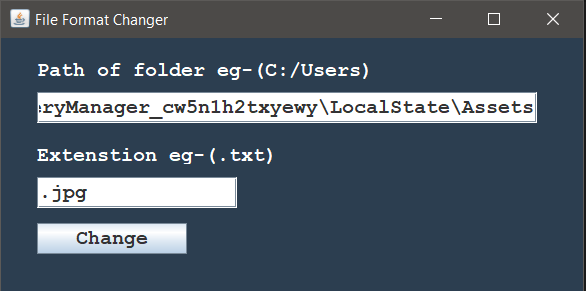

# FormatChanger
GUI based Java Program to change the extension of bunch of files.

## Exapmle: Find Windows 10's lock screen images
Use the following path with ur username
###### C:\Users\ [YOUR USERNAME] \AppData\Local\Packages\Microsoft.Windows.ContentDeliveryManager_cw5n1h2txyewy\LocalState\Assets
These files are without extension so to convert into images, add .jpg extension.

